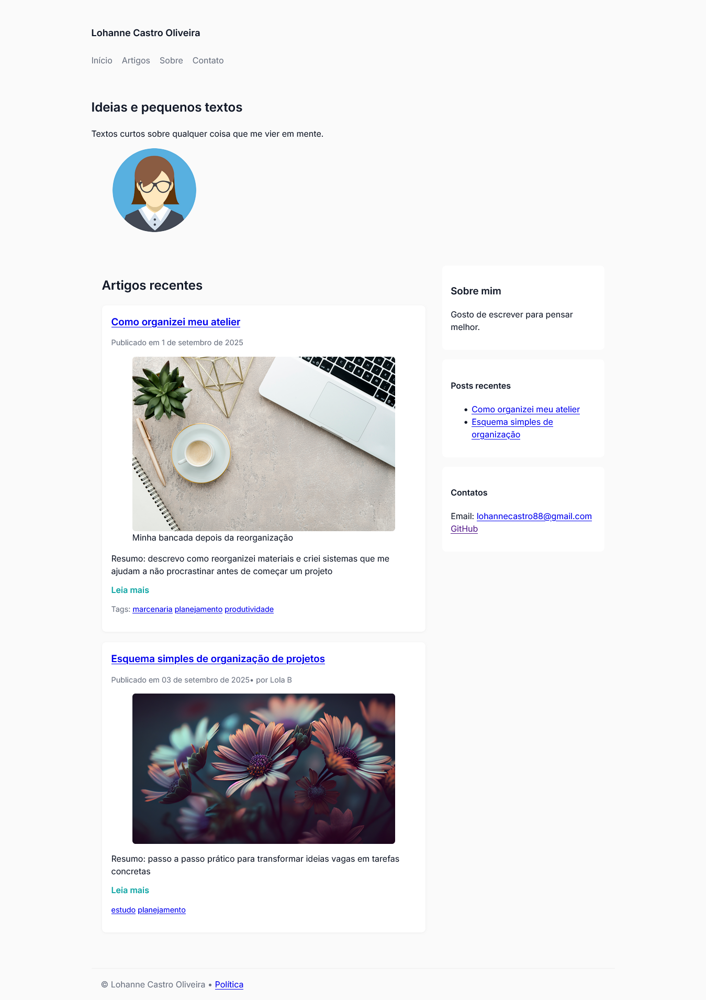

# P1-N2 — Página com Artigos (Módulo 1)

Projeto de estudo: página pessoal com múltiplos artigos usando semântica
HTML.

## Como abrir

Basta abrir `index.html` no navegador.

## Estrutura

- `index.html` — marcação
- `styles/styles.css` — estilos
- `assets/images` — imagens substitutas
- `docs/` - documento guia do projeto

---

## Prints da Página

### Página inicial

---

## PDFs

Todos os PDFs relacionados a este projeto estão na pasta `docs/`:

- [Minha Primeira Página Pessoal (Fundamentos)](docs/guia-projetoP1N2.pdf)

---

## Commits sugeridos

- feat: estrutura inicial do HTML com header e main
- feat: adicionar artigos de exemplo com cards
- style: base do CSS com variáveis, grid e responsividade
- style: ajustes de cores, hover e layout das seções

---

## Licença

MIT
